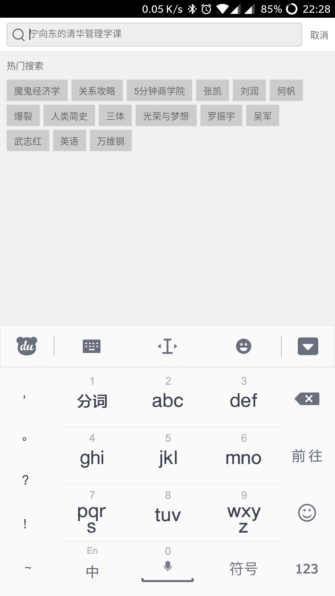

# dedao-demo

## 如何运行
1. git clone https://github.com/STMU1320/dedao-demo.git
2. npm i
3. npm start

## 项目说明
本项目采用React(16.0) + React-Router(4.2) + Redux + Redux-Saga进行基础框架搭建，运用webpack进行打包构建。
采用koa进行api数据模拟，高保真的还原了得到APP的部分页面（还在持续开发中）,此项目包含了一套基本框架，可在其基础上快速进行开发。

## 截图
首页

搜索页
